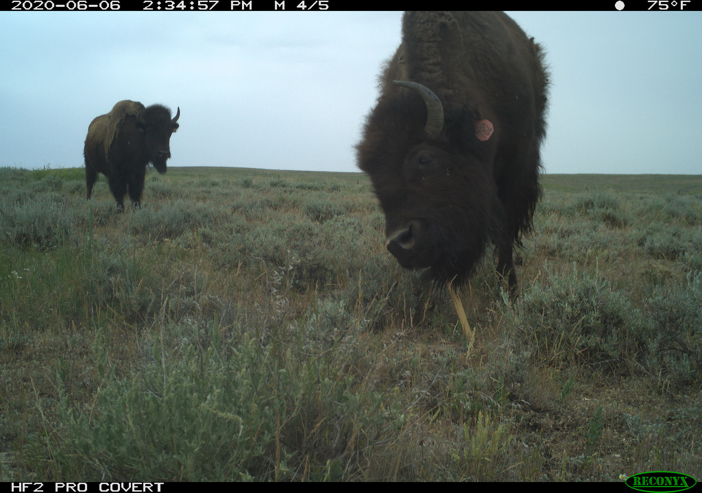
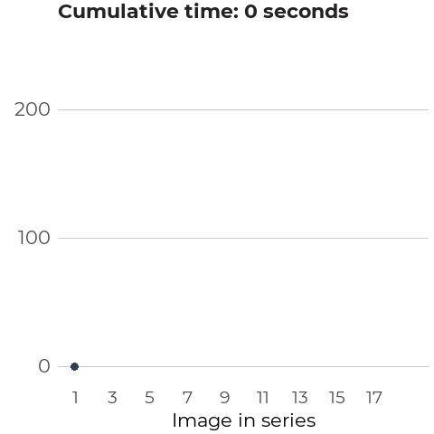
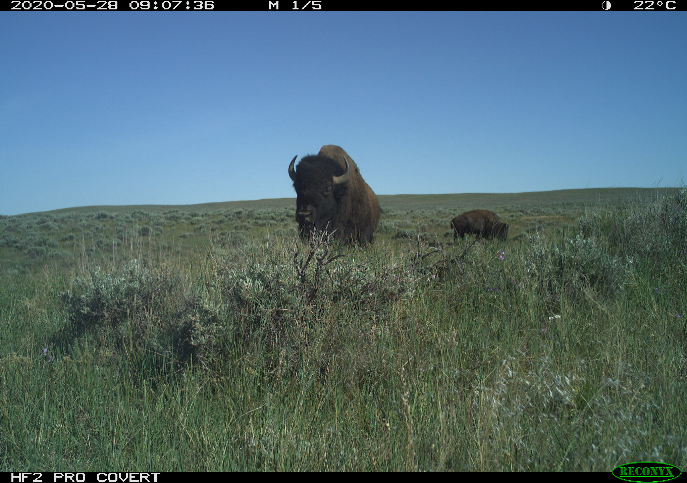
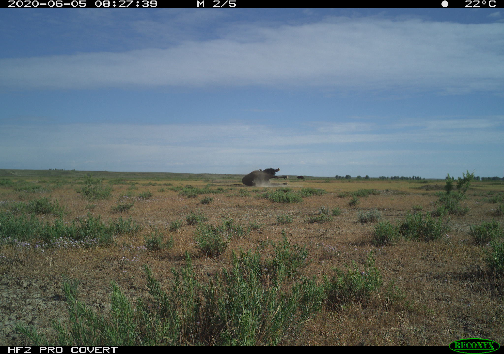
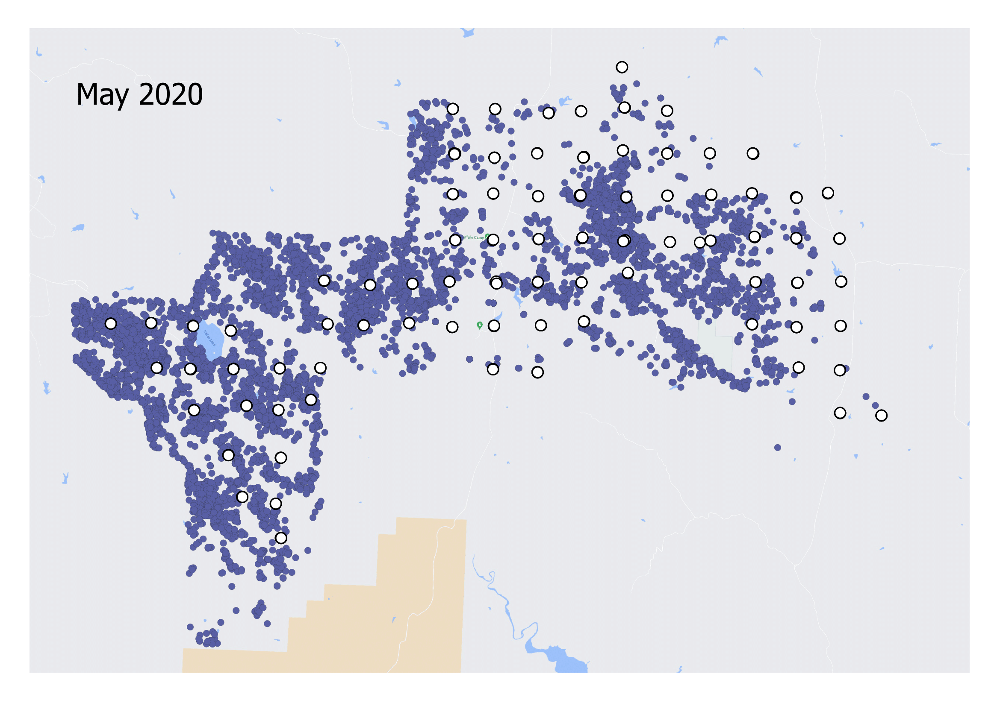

```{r setup, include=FALSE}
#options(htmltools.dir.version = FALSE)

library(xaringanthemer)
library(abmi.themes)
library(dplyr)
library(stringr)
library(sf)
library(ggplot2)
library(readr)
library(here)

add_abmi_fonts()

style_duo_accent(
  primary_color = "#2D415B",
  secondary_color = "#A8AF8C",
  inverse_header_color = "#FFFFFF",
  header_font_google = google_font("Montserrat"),
  text_font_google = google_font("Montserrat"),
  code_font_size = "0.7rem"
)

```
class: hide-logo
## Bison!

```{r echo=FALSE, fig.height=7, out.width="90%", fig.align="center", warning=FALSE, message=FALSE, dpi=600}



```

---
class: center, middle
name: interest

# What's in it for us? (ABMI!)

---

## Bison!

#### An opportunity to apply the TIFC method (Time in Front of Camera)

---

## TIFC

.pull-left[

]

.pull-right[

]

.pull-right[.footnote[Refer to Becker et al 2021 for details &#128513;]]

---

## Bison!

#### An opportunity to apply the TIFC method (Time in Front of Camera)

- American Prairie Reserve in Montana: 105-km $^2$. <b>Fenced!</b>
  
- Aerial surveys are flown to count the number of bison
  - 362 individuals in May 2020 (~ 3.6 individuals per km $^2$)
  - 425 individuals in October 2020 (approx. 60 calves were born)
  
- ~ 80 cameras deployed from May-July 2020. 
  
---
class: hide-logo
### American Prairie Reserve, Montana

<iframe src="map1.html" width="800" height="500"> </iframe>

---
class: hide-logo
## Bison!

#### An opportunity to apply the TIFC method (Time in Front of Camera)

- American Prairie Reserve in Montana: 105-km $^2$. <b>Fenced!</b>
  
- Aerial surveys are flown to count the number of bison
  - 362 individuals in May 2020 (~ 3.6 individuals per km $^2$)
  - 425 individuals in October 2020 (approx. 60 calves were born)
  
- ~ 80 cameras deployed from May-August 2020.
  - Three periods, with a refresh in between

--

#### Wrinkles

- Slightly different protocols and camera model than ABMI uses

- Shifting population size - can the cameras pick this up?

- Distinctive herding behaviour

---
class: center, middle
name: analysis

# Analysis

---
class: hide-logo
## First, another bison photo.

```{r echo=FALSE, fig.height=7, out.width="85%", fig.align="center", warning=FALSE, message=FALSE, dpi=600}



```

---

## Analysis

#### First, I'm going to look at the initial period (mid-May to mid-June)

.pull-left[
<br>
<br>
The conventional way we would estimate animal density is to derive a density estimate for each deployment, and then calculate an average across all deployments. <br> <br>
Monte Carlo simulation can be done to estimate uncertainty.
]

.pull-right[
```{r, echo=FALSE, out.width="100%", fig.align="center", warning=FALSE, message=FALSE, dpi=600, fig.showtext=TRUE}

library(abmi.themes)
library(ggplot2)

df_density <- readr::read_csv(here("density.csv"))

df_density %>%
  filter(!str_detect(deployment_id, "_R2$"),
         !density_km2 == "NaN",
         duration_days > 5) %>%
  ggplot(aes(x = density_km2)) +
  geom_histogram(fill = "#2D415B") +
  labs(x = expression(Bison~density~(animals~per~km^2)),
       y = "Number of camera deployments",
       title = "Bison density at individual\ncameras in May/June") +
  theme_abmi() +
  theme(axis.title = element_text(size = 18),
        axis.text = element_text(size = 16),
        title = element_text(size = 16))

```
]

---

## Analysis

#### First, I'm going to look at the initial period (mid-May to mid-June)

.pull-left[
<br>
<br>
This gives us an average bison density of **5.4 individuals per km $^2$ (!!!)** (90% CI: 3.1 to 8.57). <br> <br> High uncertainty, and obviously far from the true value (~ 3.6). 
]

.pull-right[
```{r, echo=FALSE, out.width="100%", fig.align="center", warning=FALSE, message=FALSE, dpi=600, fig.showtext=TRUE}

library(abmi.themes)
library(ggplot2)

df_density <- readr::read_csv(here("density.csv"))

df_density %>%
  filter(!str_detect(deployment_id, "_R2$"),
         !density_km2 == "NaN",
         duration_days > 5) %>%
  ggplot(aes(x = density_km2)) +
  geom_histogram(fill = "#2D415B") +
  labs(x = expression(Bison~density~(animals~per~km^2)),
       y = "Number of camera deployments",
       title = "Bison density at individual\ncameras in May/June") +
  theme_abmi() +
  theme(axis.title = element_text(size = 18),
        axis.text = element_text(size = 16),
        title = element_text(size = 16))

```
]

---

## Analysis

#### First, I'm going to look at the initial period (mid-May to mid-June)

.pull-left[
<br>
But I tried something different here: estimate an average bison density **by day** instead (i.e. averaging across the 80 deployments each day). <br> <br>
Logic: More variability by site than by day. <br> <br>
Use bootstrapping (with day as the resampling unit) to estimate uncertainty.
]

.pull-right[
```{r, echo=FALSE, out.width="100%", fig.align="center", warning=FALSE, message=FALSE, dpi=600, fig.showtext=TRUE}

summarise_day <- readr::read_csv(here("summarise_day.csv"))

summarise_day %>%
  filter(yday < 176) %>%
  ggplot() +
  geom_col(aes(x = date, y = density), fill = "#95A09A") +
  labs(y = expression(Bison~density~(animals~per~km^2)),
       x = "",
       title = "Bison density by day\n(Round 1)") +
  scale_x_date(date_breaks = "5 days", date_labels = "%b %d") +
  scale_y_continuous(breaks = seq(0, 30, 5), limits = c(0, 30)) +
  theme(axis.text.x = element_text(angle = 45, hjust = 1)) +
  theme_abmi() +
  theme(axis.title = element_text(size = 18),
        axis.text = element_text(size = 16),
        title = element_text(size = 16))

```

]

---

## Analysis

#### First, I'm going to look at the initial period (mid-May to mid-June)

.pull-left[
<br>
<br>
Average bison density is now **2.86 individuals per km $^2$** (90% CI: 1.55 to 4.44). <br> <br>
Estimate is better, but not necessarily higher precision (30 obs versus 80). 
]

.pull-right[
```{r, echo=FALSE, out.width="100%", fig.align="center", warning=FALSE, message=FALSE, dpi=600, fig.showtext=TRUE}

summarise_day_R1 <- readr::read_csv(here("summarise_day_R1.csv"))

library(infer)

# Mean of days
observed_mean_R1 <- summarise_day_R1 %>%
  filter(n_deployments > 20) %>%
  summarise(mean = mean(density)) #

bootstrap_R1 <- summarise_day_R1 %>%
  # Remove last two days when virtually all deployments had been removed
  filter(n_deployments > 20) %>%
  specify(response = density) %>%
  generate(reps = 10000, type = "bootstrap") %>%
  calculate(stat = "mean")

bootstrapped_mean <- mean(bootstrap_R1$stat)
conf_ints_R1 <- bootstrap_R1 %>%
  summarise(upper = quantile(stat, 0.95),
            lower = quantile(stat, 0.05))

ggplot(data = bootstrap_R1) +
  geom_density(aes(x = stat), fill = "#95A09A", alpha = 0.5) +
  geom_vline(xintercept = observed_mean_R1$mean, color = "darkred", size = 1.5) +
  # geom_vline(xintercept = bootstrapped_mean, color = "darkblue") +
  geom_vline(xintercept = conf_ints_R1$upper, color = "black", linetype = 2, size = 1) +
  geom_vline(xintercept = conf_ints_R1$lower, color = "black", linetype = 2, size = 1) +
  labs(x = expression(Bison~density~(animals~per~km^2)),
       y = "",
       title = "Variation in the mean daily estimate of density",
       subtitle = "With day as the bootstrapped resampling unit (10,000 replications)") +
  scale_x_continuous(breaks = seq(0, 6, 0.5), limits = c(0, 6)) +
  theme_abmi() +
  theme(axis.text.y = element_blank(),
        axis.ticks.y = element_blank(),
        axis.title.x = element_text(size = 20),
        axis.text.x = element_text(size = 16))

```
]

---
class: hide-logo
## Quick, another bison photo.

```{r echo=FALSE, fig.height=7, out.width="85%", fig.align="center", warning=FALSE, message=FALSE, dpi=600}



``` 

---

## Analysis

#### What about the subsequent time periods? 

--

There's something funky going on with the second round (end of June to end of July).

---
class: hide-logo
## Analysis

#### Where did all the bison go?!

```{r, echo=FALSE, fig.align="right", fig.height=4, warning=FALSE, message=FALSE, dpi=600, fig.showtext=TRUE}

library(ggtext)
library(tibble)

second_text <- tibble(
  tibble(
    x_range = c(as.Date("2020-07-14")),
    y_range = c(17.5),
    text = c("What happened after June 26?!"),
    halign = c(0)
  )
)

# Plot
ggplot(data = summarise_day) +
  geom_col(aes(x = date, y = density), fill = "#95A09A") +
  geom_vline(xintercept = as.Date("2020-06-26"), color = "darkred", size = 1, linetype = 2) +
  geom_textbox(data = second_text, aes(x_range, y_range, label = text, halign = halign),
               show.legend = FALSE, box.colour = NA, color = "#2D415B",
               size = 3.5, vjust = 0.5, height = NULL, width = NULL, family = "Montserrat") +
  labs(y = expression(Bison~density~(animals~per~km^2)),
       x = "",
       title = "Bison density by day (Rounds 1 & 2)") +
  scale_x_date(date_breaks = "5 days", date_labels = "%b %d") +
  theme_abmi() +
  theme(axis.text.x = element_text(angle = 45, hjust = 1))

```

---

## Analysis

#### Where did all the bison go?!

Not sure at this point. However, if we included this second time period, the average daily density would drop to 1.8 individuals per $km^2$. 

So something is going on regarding their movement and the placement of the cameras. 

---

## Next steps

1. Investigate (rudimentary) movement data

```{r, echo=FALSE, fig.height=5, out.width="75%", fig.align="center", warning=FALSE, message=FALSE, dpi=600}



```

---

## Next steps

2. Use landscape predictors

- NDVI
- Slope, elevation


